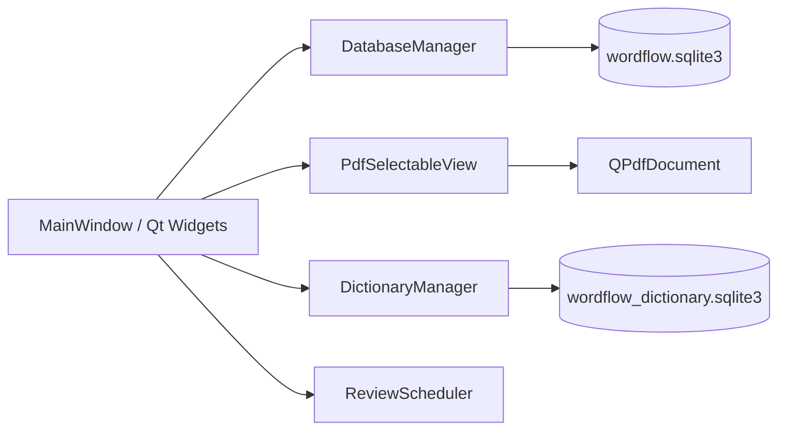

# WordFlow 课程设计交付材料

## 1. 项目概述

WordFlow 是一个 C++/Qt 6 Widgets 桌面背单词软件。它使用 SQLite 持久化单词和复习记录，提供单词管理、卡片复习、简化间隔重复、统计，以及 PDF 阅读选词与本地词典自动释义。

## 2. 技术环境

| 项目 | 使用版本/方案 |
| --- | --- |
| 语言 | C++20 |
| 界面 | Qt 6 Widgets |
| 构建 | CMake + Ninja |
| 数据库 | SQLite |
| PDF | Qt PDF `QPdfDocument` |
| 词典 | 用户导入的 ECDICT CSV，离线查询 |

## 3. 模块关系



## 4. 核心功能与算法

### 单词与复习

- 单词资料包括单词、释义、例句、来源、下次复习日期和复习次数。
- 评分对应固定间隔：Again 1 天、Hard 2 天、Good 4 天、Easy 7 天。
- 当前学习任务中，Again / Hard / Good 会进入队尾再次复习；每个单词最多出现 3 次，Easy 不重复。
- 每次评分在同一个 SQLite 事务中写入复习日志并更新单词状态。

### PDF 阅读与生词收集

- PDF 按页面渲染；支持上一页、下一页、页码跳转、缩放、适应宽度及滚轮滚动。
- 在页面中拖选文字后，以 PDF 页面坐标调用 Qt 的文本选区接口，绘制高亮并读取选择结果。
- 词典命中时自动使用中文释义；未命中时允许手动填写。
- 重复单词会提示“已在生词本中”，不会暴露底层数据库错误。

## 5. 测试记录

| 编号 | 测试 | 预期结果 | 当前结果 |
| --- | --- | --- | --- |
| T01 | 添加单词 | 保存并显示 | 已通过 |
| T02 | 修改单词 | 内容更新 | 已通过 |
| T03 | 删除单词 | 删除单词及关联日志 | 已通过 |
| T04 | 搜索单词 | 显示匹配项目 | 已通过 |
| T05 | 显示答案 | 显示释义和例句 | 已通过 |
| T06 | Again | 下次复习为 1 天后 | 已通过 |
| T07 | Good | 下次复习为 4 天后 | 已通过 |
| T08 | 完成复习 | 写入复习日志 | 已通过 |
| T09 | 重启程序 | 数据仍存在 | 已通过 |
| T10 | 无待复习项 | 显示任务完成 | 已通过 |
| E01 | PDF 拖选单词 | 左侧页面高亮并可加入生词本 | 待最终手动验收 |
| E02 | ECDICT 自动释义 | 词典命中后自动入库 | 待最终手动验收 |
| E03 | 重复 PDF 生词 | 显示友好提示，不产生重复记录 | 待最终手动验收 |

## 6. 演示流程与截图清单

1. 首页：展示今日待复习、单词总数和今日已复习。
2. 单词管理：添加一个单词，搜索、修改并展示列表。
3. 复习：显示答案后选择 Good，展示下次复习日期和本轮重复规则。
4. 统计：展示统计信息；说明“清空学习进度”仅用于调试。
5. PDF 阅读：导入带文本层的 PDF，放大页面，拖选英文单词。
6. 本地词典：导入 ECDICT CSV 后加入一个命中单词，展示自动中文释义。
7. 重复词：再次添加相同单词，展示友好提示。

建议截图文件名：`01-首页.png`、`02-单词管理.png`、`03-复习卡片.png`、`04-统计.png`、`05-PDF选词.png`、`06-自动释义.png`、`07-重复词提示.png`。

## 7. 运行与仓库

构建命令：

```powershell
qt-cmake --preset debug
cmake --build --preset debug
.\build\debug\wordflow.exe
```

代码仓库：[11carus/word_learning](https://github.com/11carus/word_learning)
