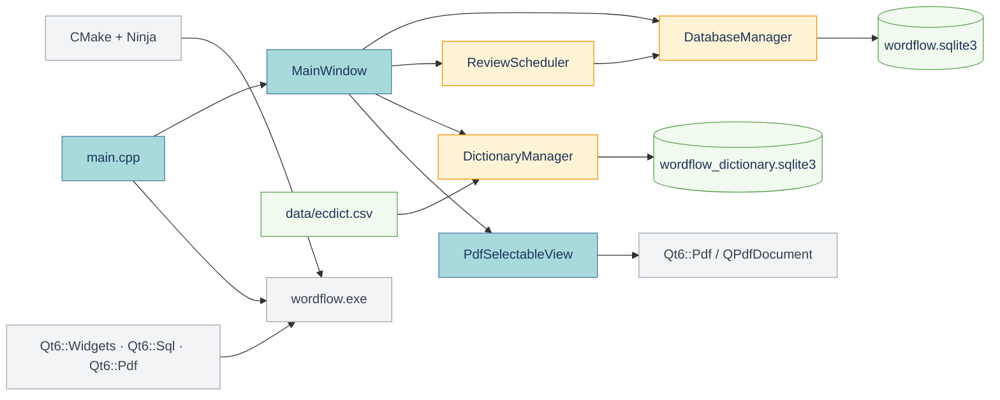

# WordFlow 项目结构图

## 目录结构

```mermaid
flowchart TB
    ROOT["WordFlow 项目根目录"]

    ROOT --> CONFIG["构建配置"]
    CONFIG --> CMAKE["CMakeLists.txt"]
    CONFIG --> PRESETS["CMakePresets.json"]

    ROOT --> SRC["src · C++ / Qt 源码"]
    SRC --> ENTRY["main.cpp · 程序入口"]
    SRC --> WINDOW["mainwindow.h/.cpp · 主窗口与业务协调"]
    SRC --> DB["database/ · 生词与复习数据"]
    SRC --> DICT["dictionary/ · ECDICT 导入与查询"]
    SRC --> PDF["pdf/ · PDF 渲染与选词"]
    SRC --> REVIEW["review/ · 复习调度算法"]

    ROOT --> DATA["data · 本地输入数据"]
    DATA --> ECDICT["ecdict.csv · 离线词典"]
    DATA --> DATAINFO["README.md · 数据说明"]

    ROOT --> DOCS["docs · 文档与课程交付"]
    DOCS --> PROJECTDOCS["开发环境、交付说明、结构图"]
    DOCS --> COURSE["course/ · 课程资料与报告模板"]
    DOCS --> REPORTS["reports/ · WordFlow 实验报告"]

    ROOT --> VSCODE[".vscode · VS Code 构建与调试配置"]
    ROOT --> BUILD["build · CMake 产物与运行数据库"]
    BUILD --> EXE["debug/wordflow.exe"]
    BUILD --> USERDB["wordflow.sqlite3"]
    BUILD --> DICTDB["wordflow_dictionary.sqlite3"]

    classDef root fill:#1D3557,color:#fff,stroke:#1D3557,stroke-width:2px;
    classDef source fill:#A8DADC,color:#1D3557,stroke:#457B9D;
    classDef data fill:#F1FAEE,color:#1D3557,stroke:#59A14F;
    classDef docs fill:#FFF3D6,color:#1D3557,stroke:#F18F01;
    classDef generated fill:#F3F4F6,color:#374151,stroke:#9CA3AF,stroke-dasharray: 5 5;

    class ROOT root;
    class SRC,ENTRY,WINDOW,DB,DICT,PDF,REVIEW source;
    class DATA,ECDICT,DATAINFO data;
    class DOCS,PROJECTDOCS,COURSE,REPORTS docs;
    class BUILD,EXE,USERDB,DICTDB generated;
```



## 核心模块关系



## 简化目录树

```text
word_learning/
├── CMakeLists.txt
├── CMakePresets.json
├── src/
│   ├── main.cpp
│   ├── mainwindow.h/.cpp
│   ├── database/
│   ├── dictionary/
│   ├── pdf/
│   └── review/
├── data/
│   ├── README.md
│   └── ecdict.csv
├── docs/
│   ├── project-structure.md
│   ├── course/
│   └── reports/
├── .vscode/
└── build/
    └── debug/
        ├── wordflow.exe
        ├── wordflow.sqlite3
        └── wordflow_dictionary.sqlite3
```
